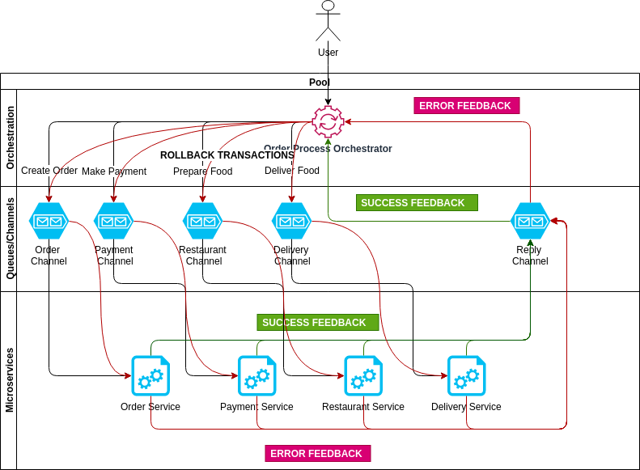

# Saga pattern

Implementation for the example in the blog post : [Microservices : SAGA orchestration pattern](https://www.prakharsrivastav.com/posts/saga-orchestration-in-microservices/)


Sage pattern is a way to maintain transactions across micro-services. In this example, we create a command driven orchestrator that orchestrates the order placement process for a 
food delivery service. 

- The orchestrator coordinates the business process between the different micro-services by sending appropriate messages to each micro-service.
- Each micro-service is capable of performing two operations
    - Start : When the orchestrator asks the service to execute an operation. (Create order, make payment, prepare food, make delivery)
    - Rollback : When the orchestrator asks the service to rollback the transaction.
- Each micro-service replies back to orchestrator on the Reply channel. The service replies to the operation with 2 statuses
    - Done: When the intended operation was successful. The orchestrator executes the next service in pipeline.
    - Error : When either of the service errors out. The orchestrator asks all the services to rollback the transaction. 

**Note**: We use redis pub/sub feature to simulate a publish-subscribe infrastructure.



## Redis channels
|direction  | name  | service| valid messages|
|---|---|----|---|
|  Orchestrator to service | OrderChannel | ServiceOrder| Start,Rollback|
|  Orchestrator to service | PaymentChannel  | ServicePayment | Start,Rollback|
|  Orchestrator to service | RestaurantChannel  | ServiceRestaurant | Start,Rollback|
|  Orchestrator to service | DeliveryChannel  | ServiceDelivery | Start,Rollback|
|  Services to Orchestrator | ReplyChannel  | ServiceOrchestrator | Done,Error|

# Running the service
run the below commands in sequence in different terminal from project root
```bash
# terminal 1
go get -u "github.com/go-redis/redis"
go get -u "syreclabs.com/go/faker"
# bring up the redis services
docker-compose up -d 

# terminal 2
go run orchestrator/main.go 

# terminal 3
go run order/main.go

# terminal 4
go run payment/main.go

# terminal 5
go run restaurant/main.go

# terminal 6
go run delivery/main.go
```

To create an order open browser and open [http://localhost:8080/create](http://localhost:8080/create)
Once the order is submitted, observe the logs on each terminal.

To demostrate rollback, the delivery service errors out, thereby rolling back the entire transaction.

The users should observe the same transaction-id on all the terminals.